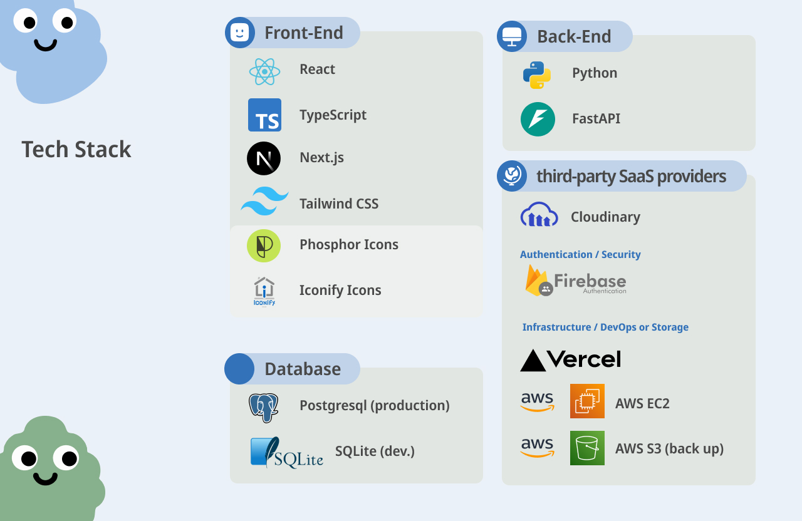
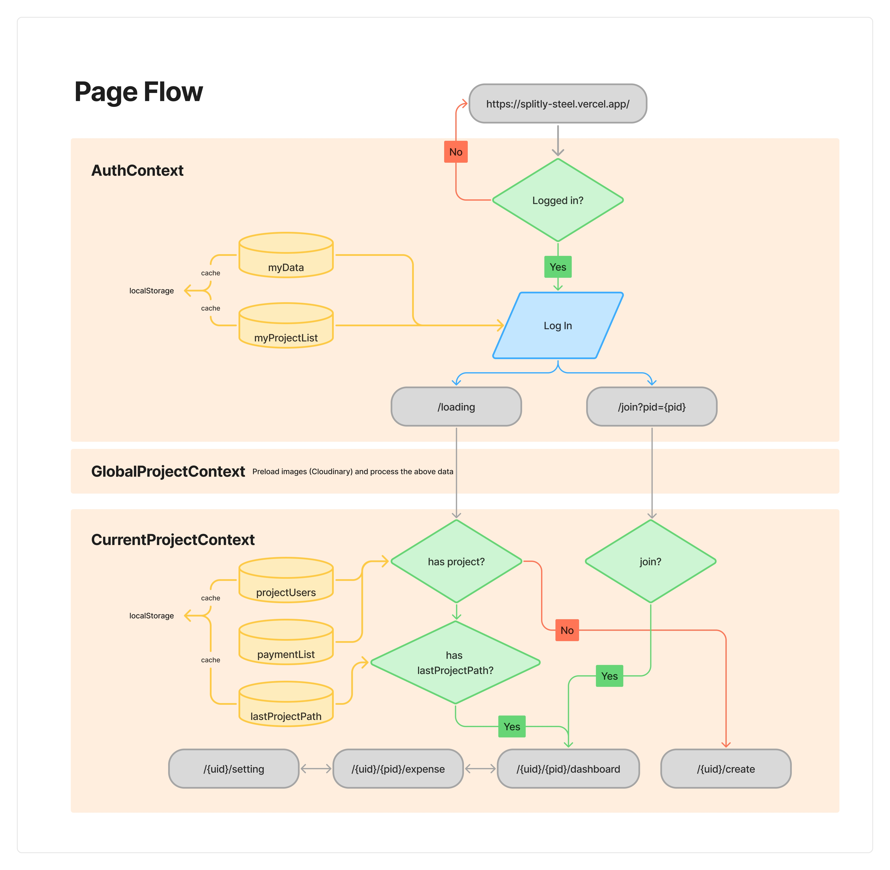
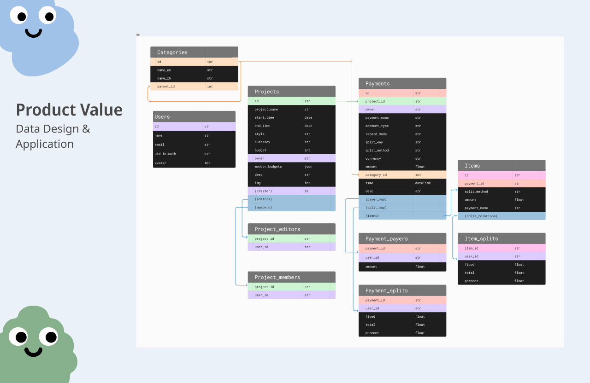
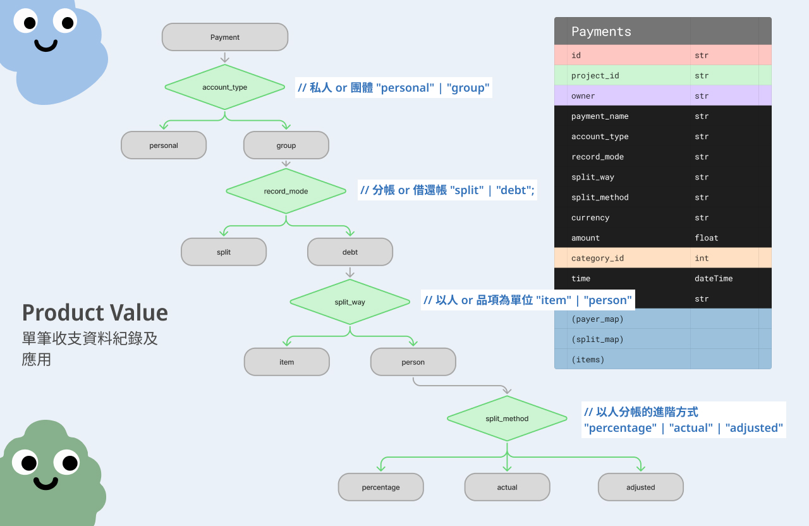
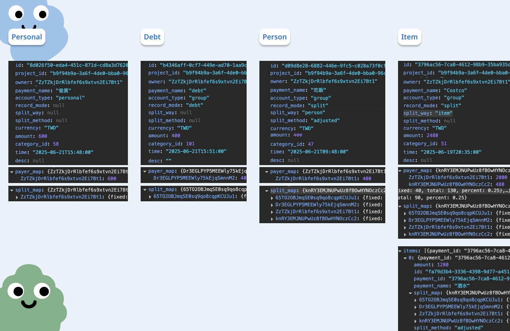
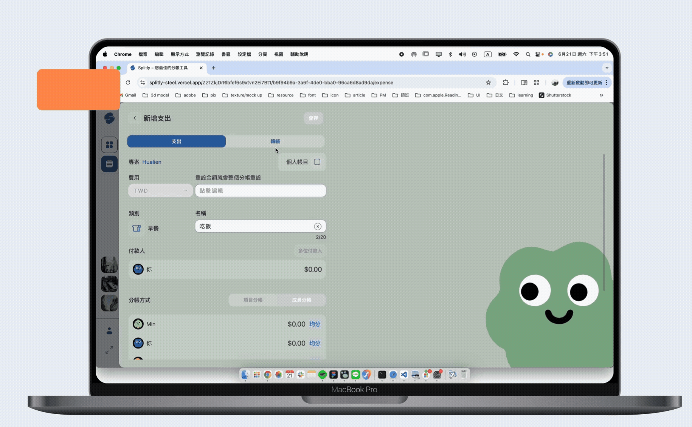

  

### https://splitly-steel.vercel.app/
> Helping you and your friends/colleagues quickly split bills and track expenses, supporting multiple splitting methods

## Tech
### Tech stack

  

### Structure

  

### Technical Topics
- React
    - React Hooks: `useState`, `useEffect`, `useRef`, `useRouter`
    - Custom Hooks (Global)
        - Handling data display requirements: `usePaymentStats`
        - Handling UI: `useIsMobile`, `useScrollDirection`, `useCarousel`
        - Caching last visited project: `useTrackLastVisitedProjectPath`
        - Managing settlements: `useSettleDebts`
    - Custom Hooks (Specific)
        - User updates: `useUpdateUser`
        - Payment CRUD: `useCreatePayment`, `useDeletePayment`, `useUpdatePayment`
        - Project CRUD: `useAddMemberProject`, `useCreateProject`, `useUpdateProject`
        - Real-time calculation of three split categories on payment creation:
`useSplitActualMap`, `useSplitAdjustMap`, `useSplitPercentageMap`
    - React Context: 
        - `AuthContext`: authentication and user profile data
        - `CategoryContext`: income/expense category data (preloaded before login)
        - `GlobalProjectContext`: transitioning from user data to project data, organizing requirements and preloading images
        - `CurrentProjectContext`: current project details and member data
        - `LoadingContext`: managing loading states
  - Use the same data schema for individuals, groups, repayments, and splits
  - Derive the splitting method from repayment values **<u>percentage, actual, update</u>** while maintaining schema flexibility
- Income & Expense Display
  - Leverage the data design to fetch and compute the fields required for each display scenario
- Third-Party Login
- Front-end/Back-end Separation (MVC)
- Cache data and ensure correctness, only calling the API when the user manually refreshes the browser
- Responsive Web Design

  
  
    
    

## Website DEMO

### Project Create & Join
- Create a project
- Send a join link to members; they use the link to join the project

  

### Payment Create & Update
- Split by individual: percentage, actual, update
- Split by item: In each item, user still can choose the splitting method: percentage, actual, update

  
  
    

### Personal Expenses
Personal expenses will only be displayed in the user's own account and will be included in their total expenses. Team members will not be able to see them."

  

### Read & Settle Payments
- View by category and income detail

  

### Settle Payments
- Two debt views: individual actual debt and simplified settlement

  

## View More
- [read more in presentation](https://www.figma.com/proto/SK132yqquO5w5M3UPLGu1N/wehelp?page-id=0%3A1&node-id=82-2&viewport=-3647%2C169%2C0.21&t=kEbRTEOd8nIkbLum-1&scaling=min-zoom&content-scaling=fixed&starting-point-node-id=82%3A2&show-proto-sidebar=1)
