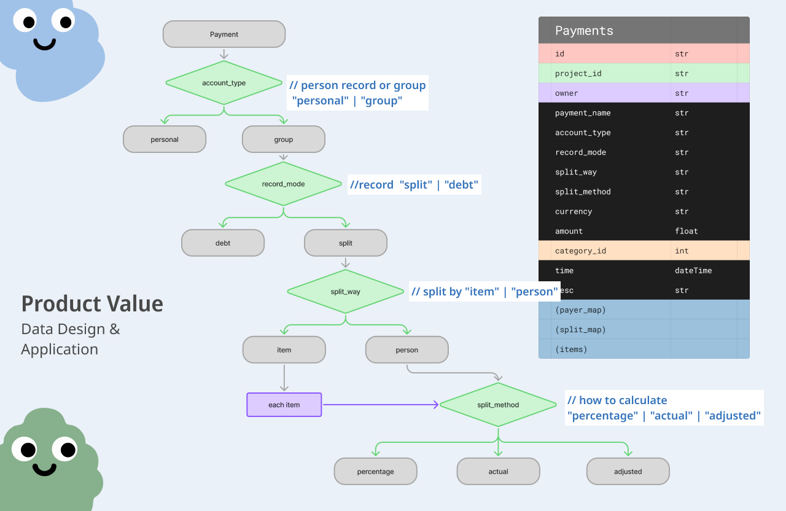

  
  Splitly

### https://splitly-steel.vercel.app/
> Helping you and your friends/colleagues quickly split bills and track expenses, supporting multiple splitting methods

## Tech
### Tech stack

  

### Structure

  

### Technical Topics
- React
- Data Design & Application
  - Use the same data schema for individuals, groups, repayments, and splits
  - Derive the splitting method from repayment values **<u>percentage, actual, update</u>** while maintaining schema flexibility
- Income & Expense Display
  - Leverage the data design to fetch and compute the fields required for each display scenario
- Third-Party Login
- Front-end/Back-end Separation (MVC)
- Cache data and ensure correctness, only calling the API when the user manually refreshes the browser
- Responsive Web Design

  
  
    

## Website DEMO

### Project Create & Join
- Create a project
- Send a join link to members; they use the link to join the project

### Payment Create & Update
- Split by individual: percentage, actual, update
- Split by item

### Read & Settle Payments
- View by category and income detail
- Two debt views: individual actual debt and simplified settlement

## View More
- [read more in presentation](https://www.figma.com/proto/SK132yqquO5w5M3UPLGu1N/wehelp?page-id=0%3A1&node-id=82-2&viewport=-3647%2C169%2C0.21&t=kEbRTEOd8nIkbLum-1&scaling=min-zoom&content-scaling=fixed&starting-point-node-id=82%3A2&show-proto-sidebar=1)
